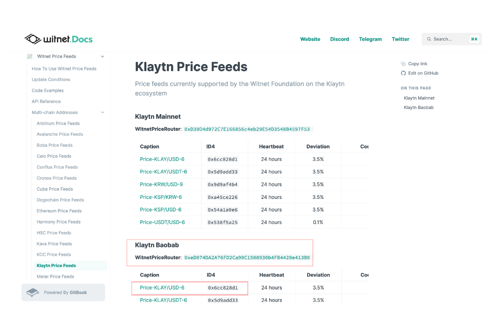
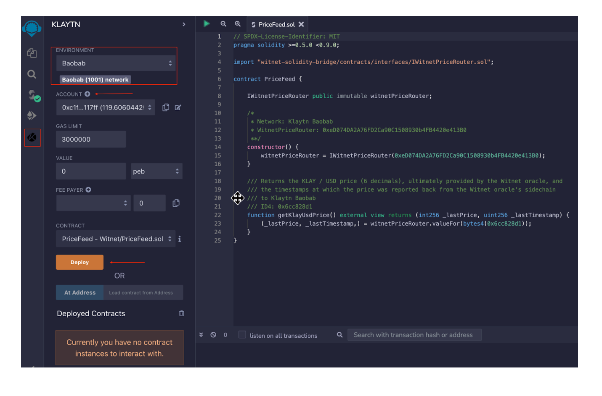
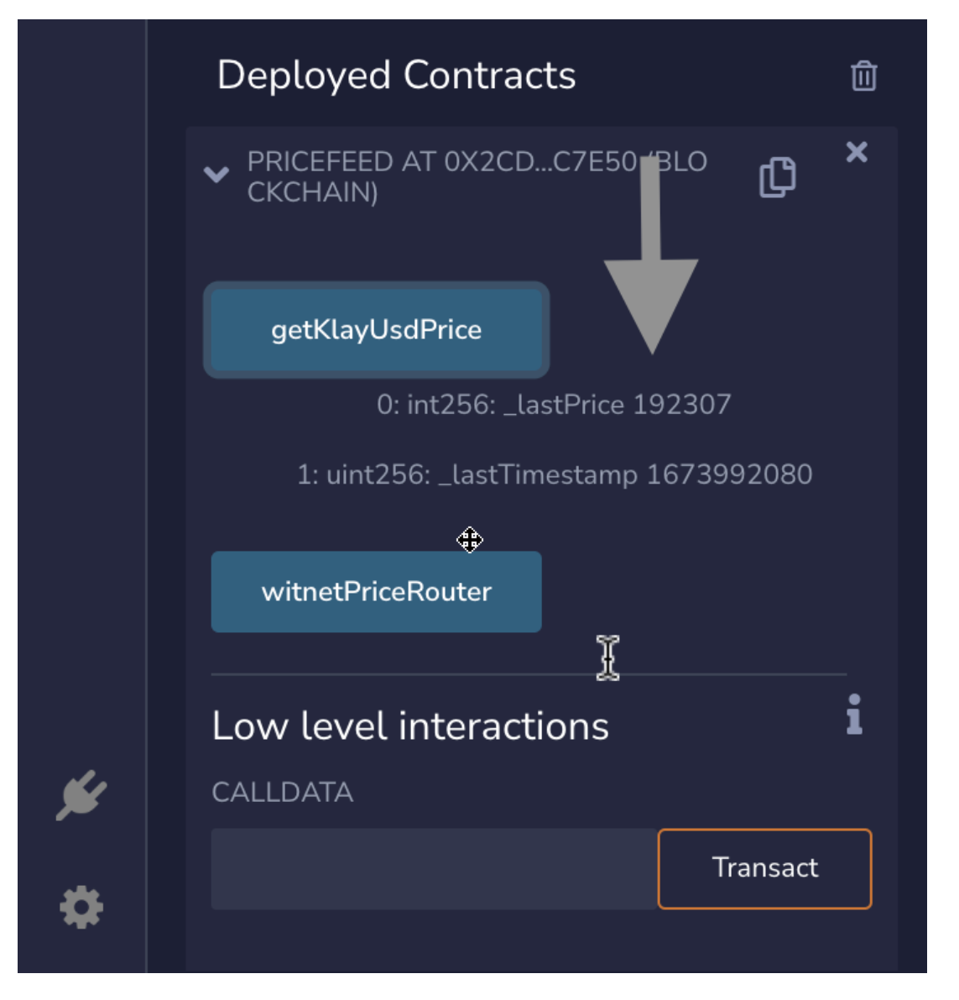

# 💻 Tutorial <a id="Witnet Price Feed Tutorial"></a>

[Witnet](https://docs.witnet.io/) multichain decentralized oracle enables smart contracts to retrieve secure and reliable data from the outside world in order to realize their true potential. These valuable data sets range from price feeds, to randomness and also information from web API et al. 

In this tutorial, you will see how to get the latest price of any of the [supported currency pairs](https://docs.witnet.io/) on Klaytn through Price Feeds.

On Witnet, there are 2 ways to get the price feed: from the *Price Feeds Router* or from a *Price Feed Contract*. Using Price Feeds Router is the easiest way to get price feeds as it removes the need to know the actual contract addresses handling the price updates from the Witnet oracle.

Witnet price feeds are timely updated with fresh data as aggregated from multiple reliable data sources and attested by the Witnet decentralized oracle network, which offers high data integrity guarantees.


## Prerequisites <a id="Prerequisites"></a> 

* [MetaMask](https://metamask.io/download/)
* [Remix IDE](https://remix.ethereum.org/)
* [Klaytn Plugin on Remix](https://klaytn.foundation/using-klaytn-plugin-on-remix/)
* Test KLAY from [Faucet](https://baobab.wallet.klaytn.foundation/faucet)

### Step 1 - Get the WitnetPriceRouter address <a id="Get the WitnetPriceRouter address "></a>

Go to [Multi-chain addresses](https://docs.witnet.io/smart-contracts/witnet-data-feeds/addresses) and select [Klaytn Price Feeds](https://docs.witnet.io/smart-contracts/witnet-data-feeds/addresses/klaytn-price-feeds).




To get the price of the KLAY/USD pair on Baobab network, we will need both the Price Router address and the ID(which represents the pair).
> WitnetPriceRouter Address: [0xeD074DA2A76FD2Ca90C1508930b4FB4420e413B0](https://baobab.scope.klaytn.com/account/0xeD074DA2A76FD2Ca90C1508930b4FB4420e413B0?tabId=txList)
> ID: *0x6cc828d1*


### Step 2 - Open Remix IDE <a id="Step2 - Open Remix IDE"></a>

Make sure you have the [Klaytn Plugin](https://klaytn.foundation/using-klaytn-plugin-on-remix/) installed.

Click this [link](https://remix.ethereum.org/#url=https://github.com/tantely-klaytn/witnet-oracle/blob/main/PriceFeed.sol) to open the code in [Remix](https://remix.ethereum.org/#url=https://github.com/tantely-klaytn/witnet-oracle/blob/main/PriceFeed.sol):

or use the code below


```javascript
// SPDX-License-Identifier: MIT
pragma solidity >=0.5.0 <0.9.0;

import "witnet-solidity-bridge/contracts/interfaces/IWitnetPriceRouter.sol";

contract PriceFeed {

    IWitnetPriceRouter public immutable witnetPriceRouter;
    
    /*
     * Network: Klaytn Baobab
     * WitnetPriceRouter: 0xeD074DA2A76FD2Ca90C1508930b4FB4420e413B0
     **/
    constructor() {
        witnetPriceRouter = IWitnetPriceRouter(0xeD074DA2A76FD2Ca90C1508930b4FB4420e413B0);
    }

    /// Returns the KLAY / USD price (6 decimals), ultimately provided by the Witnet oracle, and
    /// the timestamps at which the price was reported back from the Witnet oracle's sidechain 
    /// to Klaytn Baobab. 
    /// ID4: 0x6cc828d1
    function getKlayUsdPrice() external view returns (int256 _lastPrice, uint256 _lastTimestamp) {
        (_lastPrice, _lastTimestamp,) = witnetPriceRouter.valueFor(bytes4(0x6cc828d1));
    }
}

```
If you look at the parameter in the constructor and in the `getKLayUsdPrice` function, we have used the address of the WitnetPriceRouter and the ID4 mentioned above.

### Step 3 - Compile and Deploy the contract <a id="Step 3 - Compile and Deploy the contract"></a>

Select the Klaytn icon in the sidebar to use the Klaytn plugin. Choose baobab environment and add your account by providing your [MetaMask private key](https://metamask.zendesk.com/hc/en-us/articles/360015289632-How-to-export-an-account-s-private-key#:~:text=On%20the%20account%20page%2C%20click,click%20%E2%80%9CConfirm%E2%80%9D%20to%20proceed.). Make sure you have enough test KLAY from [Faucet](https://baobab.wallet.klaytn.foundation/faucet).



Now you have your contract deployed. 

### Step 4 - Get the KLAY/USD price <a id="Step 4 - Get the KLAY/USD price"></a>
Once your contract is deployed, you will be able to see the PriceFeed contract under the "Deployed Contracts" section. Click on it, and the available functions will show up. Here, we have the *getKlayUsdPrice* function.



Click on it to fetch the current price of KLAY per USD. At the time of writing, it is `192307`, which means 1 KLAY equals to **$0.192307**.

## Conclusion <a id="Conclusion"></a>
In this tutorial, we saw how to use Witnet oracle to get the Price Feed on baobab testnet. These same steps can be applied when trying to get the price Feed on Klaytn Cypress(Mainnet).  If you want more information, visit [Klaytn Docs](https://docs.klaytn.foundation/) and [Witnet Oracle Docs](https://docs.witnet.io/). If you have any questions, visit [Klaytn Forum](https://forum.klaytn.foundation/).


:::info
If you have any questions, please join our [Discord server](https://discord.io/KlaytnOfficial), or send us an email at developers@klaytn.foundation
:::