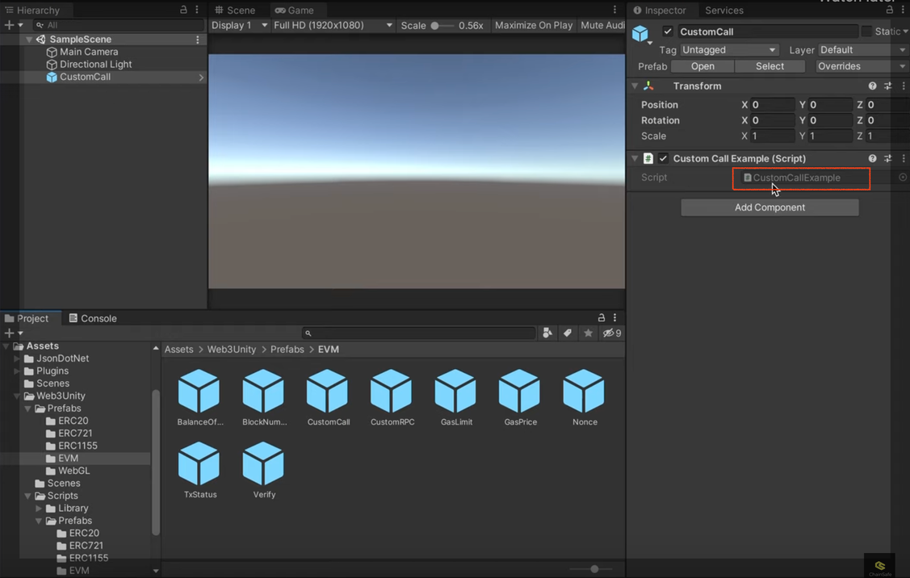

# Custom Call <a id="Custom Call"></a>

In this section you will see how to get the balance of a given address on Klaytn mainnet, using a RPC provider.

Start by creating a new project by following the steps at the section [Create a new Unity project](./create-a-new-unity-project.md). Make sure to install all dependencies to fix all bugs.

## Create your C# script on Unity <a id="Create your C# script on Unity"></a>

Click on **Web3Unity** package → **Prefabs** → **EVM** → **Custom Call**

Drag the **CustomCall** prefab into the scene.


Double-click on the **CustomCallExample** script to open it on VSCode.



Use the script below or modify it:

```javascript

using System.Collections;
using System.Collections.Generic;
using UnityEngine;

public class CustomCallExample : MonoBehaviour
{
    async void Start()
    {
        // set chain: ethereum, polygon, klaytn, etc
        string chain = "klaytn";
        // set network mainnet, testnet
        string network = "mainnet"; 
        // set smart contract address
        string account = "0x94404aEc273e50f741c0e166CC55a372D5c6Df7C";
        // set rpc endpoint url
        string rpc = "https://public-node-api.klaytnapi.com/v1/cypress";
        
        // call a transaction
        string balance = await EVM.BalanceOf(chain, network, account, rpc);
        // display response in game
        print(balance);      
       
    }
}

```

Edit the network chainID under **Assets** → **WebGLTemplates** → **Web3GL-2020x** → **network.js**. Set the *window.web3ChainId* to **8217** (Klaytn mainnet).

Run the script by clicking on the ▶️ button above the scene.

Open the console to see the result.

The console shows the balance of the given contract on Klaytn mainnet.


