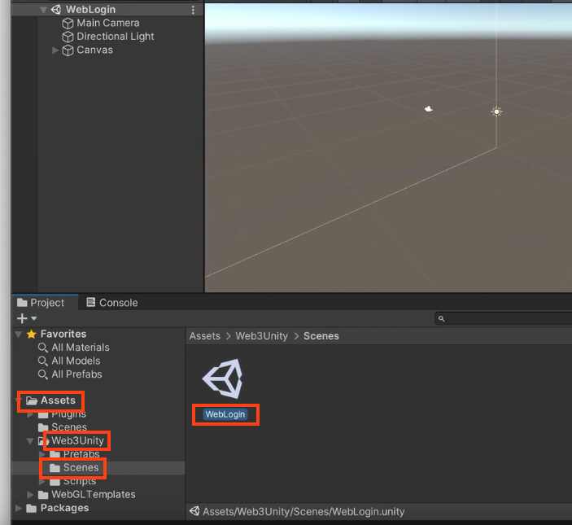
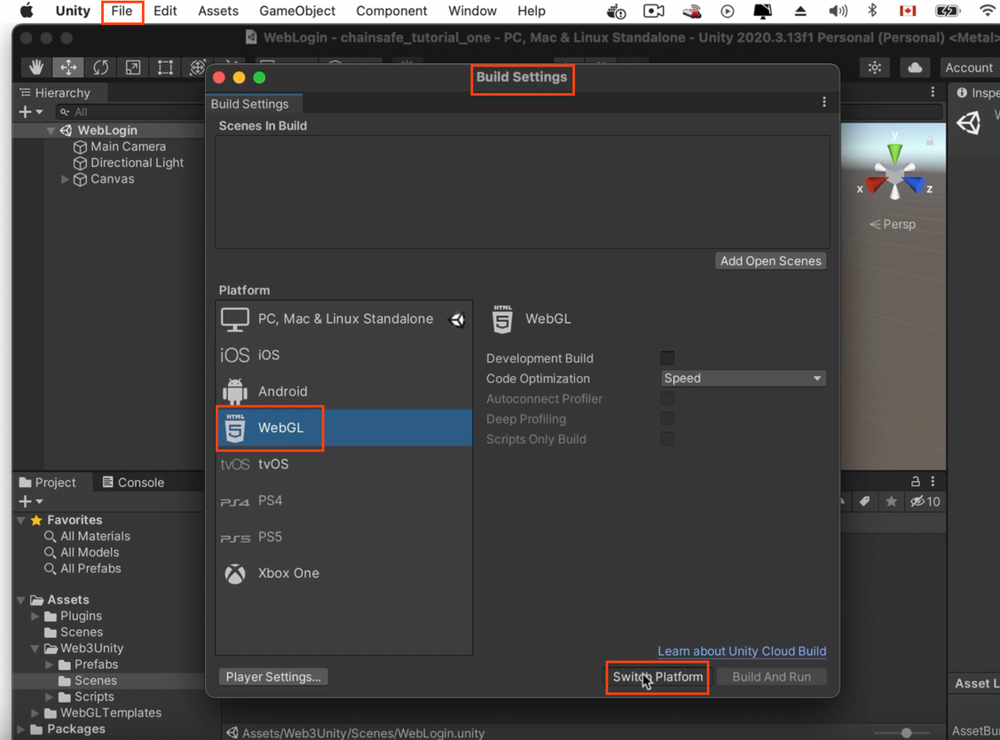
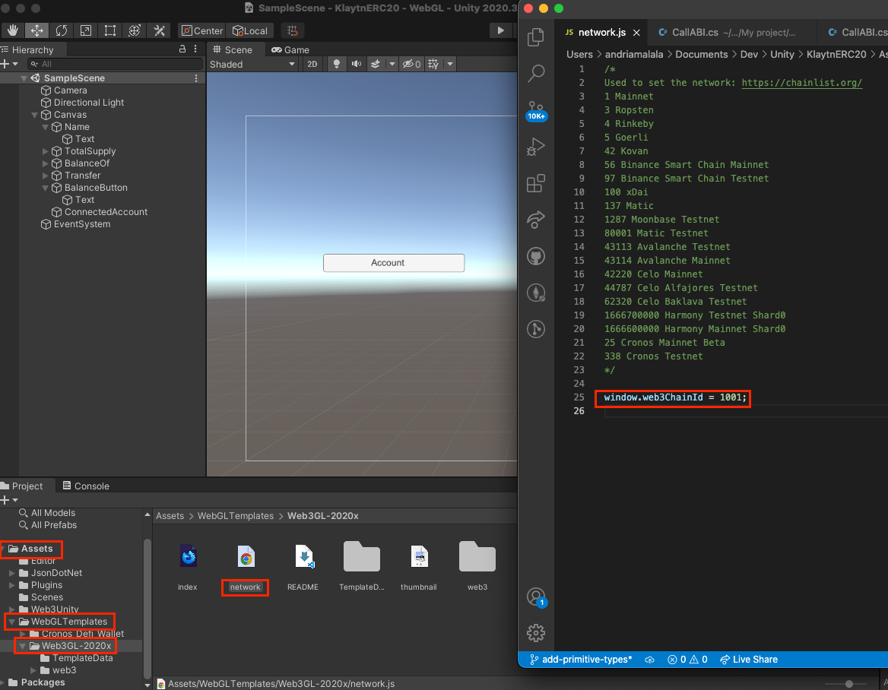
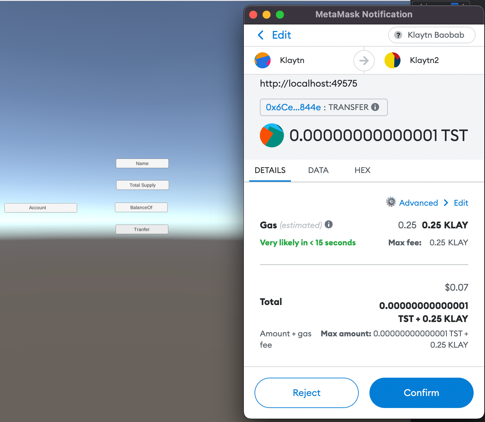

# How to use the KIP7 token <a id="How to use the KIP7 token"></a>

In this section you will see how to build a Unity project using the KIP7 (ERC-20) token standard on Klaytn.


## Getting Started <a id="Getting Started"></a>

Start by creating a new project by following the steps at the section [Create a new Unity project](./create-a-new-unity-project.md).
Make sure to install all dependencies to fix all bugs.

**Use the WebLogin prefab to enable web3 wallet connection**

Under **Assets** → **Web3Unity** → **Scenes**, double-click on **WebLogin**. This is the prefab used to connect a wallet in a WebGL project.



Go to **File** → **Build Settings** → **WebGL** → **Switch Platform**



From the same window, click on **Add Open Scenes** (top right) to add the Login scene as the first scene to appear when we run the project.

From the same window, click on **Player Settings** → **Player** → **Resolution and Presentation**, under **WebGL Template**, select the one with the same as our Unity version (WebGL 2020 for our case).


Go back to the Unity project. Under **Assets**, select **Scenes** and double-click on **SampleScene** to use it as our second scene (FYI the first one is the login scene).

Go to **File** → **Build Settings** → **Add Open Scenes**. The SampleScene will appear under the WebLogin scene. It means the SampleScene, where we will create the buttons to read and write to the contract, will be the next scene after the *WebLogin*. 

> Make sure the WebLogin scene is at the top because the order matters.


## Create your Contract <a id="Create your Contract"></a>

* Open [Remix IDE](https://remix.ethereum.org/#optimize=false&runs=200&evmVersion=null), install the [Klaytn Remix plugin](https://klaytn.foundation/using-klaytn-plugin-on-remix/) then paste the code below:

```javascript
// SPDX-License-Identifier: MIT
pragma solidity ^0.8.0;

import "@klaytn/contracts/KIP/token/KIP7/KIP7.sol";
import "@klaytn/contracts/access/Ownable.sol";

contract MyToken is KIP7, Ownable {
    constructor() KIP7("Test Token", "TST") {     
        _mint(msg.sender, 100000 * 10 ** 18);        
    }

     function mintToken(address account, uint256 amount) public onlyOwner {
        _safeMint(account, amount);
    }
}

```

* Compile your contract and deploy it to baobab testnet. Get your faucet [here](https://baobab.wallet.klaytn.foundation/faucet).


## Create your C# script on Unity <a id="Create your C# script on Unity"></a>

Under **Project** window, right-click on **Scenes**, click on **Create** → **C# Script**. Use the script below.

```java

using System.Collections;
using System.Collections.Generic;
using UnityEngine;
using System;
using System.Numerics;
using UnityEngine.UI;
using Newtonsoft.Json;

public class ERC20CUSTOM : MonoBehaviour
{

    // set chain: ethereum, polygon, klaytn, etc
    string chain = "klaytn";
    // set network mainnet, testnet
    string network = "testnet"; 
    // wallet address that deployed the contract
    private string account = "0x7b9B65d4ee2FD57fC0DcFB3534938D31f63cba65";
    // set ABI
    private readonly string abi = "[ { \"inputs\": [], \"stateMutability\": \"nonpayable\", \"type\": \"constructor\" }, { \"anonymous\": false, \"inputs\": [ { \"indexed\": true, \"internalType\": \"address\", \"name\": \"owner\", \"type\": \"address\" }, { \"indexed\": true, \"internalType\": \"address\", \"name\": \"spender\", \"type\": \"address\" }, { \"indexed\": false, \"internalType\": \"uint256\", \"name\": \"value\", \"type\": \"uint256\" } ], \"name\": \"Approval\", \"type\": \"event\" }, { \"anonymous\": false, \"inputs\": [ { \"indexed\": true, \"internalType\": \"address\", \"name\": \"previousOwner\", \"type\": \"address\" }, { \"indexed\": true, \"internalType\": \"address\", \"name\": \"newOwner\", \"type\": \"address\" } ], \"name\": \"OwnershipTransferred\", \"type\": \"event\" }, { \"anonymous\": false, \"inputs\": [ { \"indexed\": true, \"internalType\": \"address\", \"name\": \"from\", \"type\": \"address\" }, { \"indexed\": true, \"internalType\": \"address\", \"name\": \"to\", \"type\": \"address\" }, { \"indexed\": false, \"internalType\": \"uint256\", \"name\": \"value\", \"type\": \"uint256\" } ], \"name\": \"Transfer\", \"type\": \"event\" }, { \"inputs\": [ { \"internalType\": \"address\", \"name\": \"owner\", \"type\": \"address\" }, { \"internalType\": \"address\", \"name\": \"spender\", \"type\": \"address\" } ], \"name\": \"allowance\", \"outputs\": [ { \"internalType\": \"uint256\", \"name\": \"\", \"type\": \"uint256\" } ], \"stateMutability\": \"view\", \"type\": \"function\" }, { \"inputs\": [ { \"internalType\": \"address\", \"name\": \"spender\", \"type\": \"address\" }, { \"internalType\": \"uint256\", \"name\": \"amount\", \"type\": \"uint256\" } ], \"name\": \"approve\", \"outputs\": [ { \"internalType\": \"bool\", \"name\": \"\", \"type\": \"bool\" } ], \"stateMutability\": \"nonpayable\", \"type\": \"function\" }, { \"inputs\": [ { \"internalType\": \"address\", \"name\": \"account\", \"type\": \"address\" } ], \"name\": \"balanceOf\", \"outputs\": [ { \"internalType\": \"uint256\", \"name\": \"\", \"type\": \"uint256\" } ], \"stateMutability\": \"view\", \"type\": \"function\" }, { \"inputs\": [], \"name\": \"decimals\", \"outputs\": [ { \"internalType\": \"uint8\", \"name\": \"\", \"type\": \"uint8\" } ], \"stateMutability\": \"view\", \"type\": \"function\" }, { \"inputs\": [ { \"internalType\": \"address\", \"name\": \"spender\", \"type\": \"address\" }, { \"internalType\": \"uint256\", \"name\": \"subtractedValue\", \"type\": \"uint256\" } ], \"name\": \"decreaseAllowance\", \"outputs\": [ { \"internalType\": \"bool\", \"name\": \"\", \"type\": \"bool\" } ], \"stateMutability\": \"nonpayable\", \"type\": \"function\" }, { \"inputs\": [ { \"internalType\": \"address\", \"name\": \"spender\", \"type\": \"address\" }, { \"internalType\": \"uint256\", \"name\": \"addedValue\", \"type\": \"uint256\" } ], \"name\": \"increaseAllowance\", \"outputs\": [ { \"internalType\": \"bool\", \"name\": \"\", \"type\": \"bool\" } ], \"stateMutability\": \"nonpayable\", \"type\": \"function\" }, { \"inputs\": [ { \"internalType\": \"address\", \"name\": \"account\", \"type\": \"address\" }, { \"internalType\": \"uint256\", \"name\": \"amount\", \"type\": \"uint256\" } ], \"name\": \"mintToken\", \"outputs\": [], \"stateMutability\": \"nonpayable\", \"type\": \"function\" }, { \"inputs\": [], \"name\": \"name\", \"outputs\": [ { \"internalType\": \"string\", \"name\": \"\", \"type\": \"string\" } ], \"stateMutability\": \"view\", \"type\": \"function\" }, { \"inputs\": [], \"name\": \"owner\", \"outputs\": [ { \"internalType\": \"address\", \"name\": \"\", \"type\": \"address\" } ], \"stateMutability\": \"view\", \"type\": \"function\" }, { \"inputs\": [], \"name\": \"renounceOwnership\", \"outputs\": [], \"stateMutability\": \"nonpayable\", \"type\": \"function\" }, { \"inputs\": [ { \"internalType\": \"address\", \"name\": \"recipient\", \"type\": \"address\" }, { \"internalType\": \"uint256\", \"name\": \"amount\", \"type\": \"uint256\" } ], \"name\": \"safeTransfer\", \"outputs\": [], \"stateMutability\": \"nonpayable\", \"type\": \"function\" }, { \"inputs\": [ { \"internalType\": \"address\", \"name\": \"recipient\", \"type\": \"address\" }, { \"internalType\": \"uint256\", \"name\": \"amount\", \"type\": \"uint256\" }, { \"internalType\": \"bytes\", \"name\": \"_data\", \"type\": \"bytes\" } ], \"name\": \"safeTransfer\", \"outputs\": [], \"stateMutability\": \"nonpayable\", \"type\": \"function\" }, { \"inputs\": [ { \"internalType\": \"address\", \"name\": \"sender\", \"type\": \"address\" }, { \"internalType\": \"address\", \"name\": \"recipient\", \"type\": \"address\" }, { \"internalType\": \"uint256\", \"name\": \"amount\", \"type\": \"uint256\" } ], \"name\": \"safeTransferFrom\", \"outputs\": [], \"stateMutability\": \"nonpayable\", \"type\": \"function\" }, { \"inputs\": [ { \"internalType\": \"address\", \"name\": \"sender\", \"type\": \"address\" }, { \"internalType\": \"address\", \"name\": \"recipient\", \"type\": \"address\" }, { \"internalType\": \"uint256\", \"name\": \"amount\", \"type\": \"uint256\" }, { \"internalType\": \"bytes\", \"name\": \"_data\", \"type\": \"bytes\" } ], \"name\": \"safeTransferFrom\", \"outputs\": [], \"stateMutability\": \"nonpayable\", \"type\": \"function\" }, { \"inputs\": [ { \"internalType\": \"bytes4\", \"name\": \"interfaceId\", \"type\": \"bytes4\" } ], \"name\": \"supportsInterface\", \"outputs\": [ { \"internalType\": \"bool\", \"name\": \"\", \"type\": \"bool\" } ], \"stateMutability\": \"view\", \"type\": \"function\" }, { \"inputs\": [], \"name\": \"symbol\", \"outputs\": [ { \"internalType\": \"string\", \"name\": \"\", \"type\": \"string\" } ], \"stateMutability\": \"view\", \"type\": \"function\" }, { \"inputs\": [], \"name\": \"totalSupply\", \"outputs\": [ { \"internalType\": \"uint256\", \"name\": \"\", \"type\": \"uint256\" } ], \"stateMutability\": \"view\", \"type\": \"function\" }, { \"inputs\": [ { \"internalType\": \"address\", \"name\": \"to\", \"type\": \"address\" }, { \"internalType\": \"uint256\", \"name\": \"amount\", \"type\": \"uint256\" } ], \"name\": \"transfer\", \"outputs\": [ { \"internalType\": \"bool\", \"name\": \"\", \"type\": \"bool\" } ], \"stateMutability\": \"nonpayable\", \"type\": \"function\" }, { \"inputs\": [ { \"internalType\": \"address\", \"name\": \"from\", \"type\": \"address\" }, { \"internalType\": \"address\", \"name\": \"to\", \"type\": \"address\" }, { \"internalType\": \"uint256\", \"name\": \"amount\", \"type\": \"uint256\" } ], \"name\": \"transferFrom\", \"outputs\": [ { \"internalType\": \"bool\", \"name\": \"\", \"type\": \"bool\" } ], \"stateMutability\": \"nonpayable\", \"type\": \"function\" }, { \"inputs\": [ { \"internalType\": \"address\", \"name\": \"newOwner\", \"type\": \"address\" } ], \"name\": \"transferOwnership\", \"outputs\": [], \"stateMutability\": \"nonpayable\", \"type\": \"function\" } ]";
    // set rpc endpoint url
    string rpc = "https://public-node-api.klaytnapi.com/v1/baobab";

    // set contract address
    private string contract = "0xAc88Ee877D1dCf6da3672099FE4618c9d30F0d0B";
    // set recipient address
    private string toAccount = "0x7AB1b3C8396aDE55F959fB9B2dA43deFDdA23c52";
    // set amount to transfer
    private string amount = "10000";

    // Use this if you want to display the balance of an account
    /*public Text balance;

    
     void Start() 
     {
         string account = PlayerPrefs.GetString("Account");
         balance.text = account;
    }
    */

    // call the "name" function
    async public void Name()
    {
        // function name
        string method = "name";
        // arguments
        string args = "[]";
        try
        {
        string response = await EVM.Call(chain, network, contract, abi, method, args,rpc);            
        Debug.Log("Token name: " + response);
        } catch(Exception e) 
        {
            Debug.LogException(e, this);
        }
    }

    // call the "totalSupply" function
    async public void TotalSupply()
    {
        // function name
        string method = "totalSupply";
        // arguments
        string args = "[]";
        try
        {
        string response = await EVM.Call(chain, network, contract, abi, method, args,rpc);            
            Debug.Log("Total Supply: " + response);
        } catch(Exception e) 
        {
            Debug.LogException(e, this);
        }
    }

    // call the "balanceOf" function
    async public void BalanceOf()
    {
        // function name
        string method = "balanceOf";
        // arguments
        string args = "[\"0x7b9B65d4ee2FD57fC0DcFB3534938D31f63cba65\"]";
        try
        {
        string response = await EVM.Call(chain, network, contract, abi, method, args,rpc);            
            Debug.Log("Balance of 0x7b9B65d4ee2FD57fC0DcFB3534938D31f63cba65: " + response);
        } catch(Exception e) 
        {
            Debug.LogException(e, this);
        }
    }

    // call the "transfer" function
    async public void Transfer()
    {
        // function name
        string method = "transfer";
        // put arguments in an array of string
        string[] obj = {toAccount, amount};
        // serialize arguments
        string args = JsonConvert.SerializeObject(obj);
        // value in ston (wei) in a transaction
        string value = "0";
        // gas limit: REQUIRED
        string gasLimit = "1000000";
        // gas price: REQUIRED
        string gasPrice = "250000000000";
        try
        {          
        string response = await Web3GL.SendContract(method, abi, contract, args, value, gasLimit, gasPrice);            
            Debug.Log(response);
        } catch(Exception e) 
        {
            Debug.LogException(e, this);
        }
    }
    
      // call the "safeTransfer" function
      async public void SafeTransfer()
    {
        string method = "safeTransfer";
        string[] obj = {toAccount, amount};
        string args = JsonConvert.SerializeObject(obj);
        string value = "0";
        // gas limit OPTIONAL
        string gasLimit = "1000000";
        // gas price OPTIONAL
        string gasPrice = "250000000000";
        try
        {
        //string response = await Web3GL.SendContract(chain, network, contract, abi, method, args,rpc);            
        string response = await Web3GL.SendContract(method, abi, contract, args, value, gasLimit, gasPrice);            
        Debug.Log(response);
        } catch(Exception e) 
        {
            Debug.LogException(e, this);
        }
    }

    // call the "mintToken" function
    async public void Mint()
    {
        // recipient
        string toAccount = "0x57468012dF29B5f1C4b5baCD1CD2F0e2eC323316";
        // amount to send
        string amount = "100";
        // function name
        string method = "mintToken";
        // put arguments in an array of string
        string[] obj = {toAccount, amount};
        // serialize arguments
        string args = JsonConvert.SerializeObject(obj);
        // value in ston (wei) in a transaction
        string value = "0";
        // gas limit: REQUIRED
        string gasLimit = "1000000";
        // gas price: REQUIRED
        string gasPrice = "250000000000";
        try
        {            
        string response = await Web3GL.SendContract(method, abi, contract, args, value, gasLimit, gasPrice);           
            Debug.Log(response);
        } catch(Exception e) 
        {
            Debug.LogException(e, this);
        }
    }
    
    // call the "approve" function
    async public void Approve()
    {
        // spender
        string spender = "0x57468012dF29B5f1C4b5baCD1CD2F0e2eC323316";
       // amount
        string amount = "100";
       // function name
        string method = "approve";
       // put arguments in an array of string
        string[] obj = {spender, amount};
       // serialize arguments
        string args = JsonConvert.SerializeObject(obj);
        string value = "0";
       // gas limit OPTIONAL
        string gasLimit = "1000000";
       // gas price OPTIONAL
        string gasPrice = "250000000000";
        try
        {            
        string response = await Web3GL.SendContract(method, abi, contract, args, value, gasLimit, gasPrice);           
        Debug.Log(response);
        } catch(Exception e) 
        {
            Debug.LogException(e, this);
        }
    }
}

```

We will create 7 buttons ( **Name**, **Total Supply**, **BalanceOf**, **Transfer**, **SafeTransfer**, **Mint** and **Approve**) on the UI to interact with our KIP7 token.

To create the buttons, follow the steps in the section [Custom Interaction with Login](./custom-interaction-with-login.md).

Your UI should look like this:


Link each button the the corresponding function in the contract. E.g here, we linked the button **Name** to the function Name() in the script, which calls the function name() in the contract.


Change the `chainId` of the network in the WebGL Templates folder to 1001 to connect to baobab testnet



Click on ▶️ to run the program and test the **Name**, **Total Supply** and **BalanceOf** buttons.


## Test the Transfer and the Mint function <a id="Test the Transfer and the Mint function"></a>

To test the **Transfer** button, we need to build and run the project. So go to **File** → **Build and Run**

Click on **Login** to connect Metamask.


Once connected, click on `Transfer` to execute the KIP7 token transfer.



Here are the details of the transaction on [Klaytnscope](https://baobab.scope.klaytn.com/tx/0x1b9c6c4a21fa2bfd5e304c647908e26e0f0c4d5fed8d727bce1d586cca2afab1?tabId=eventLog).

To test the `Mint` and `SafeTransfer` function, click on the corresponding button and confirm your transaction on Klaytnscope.


