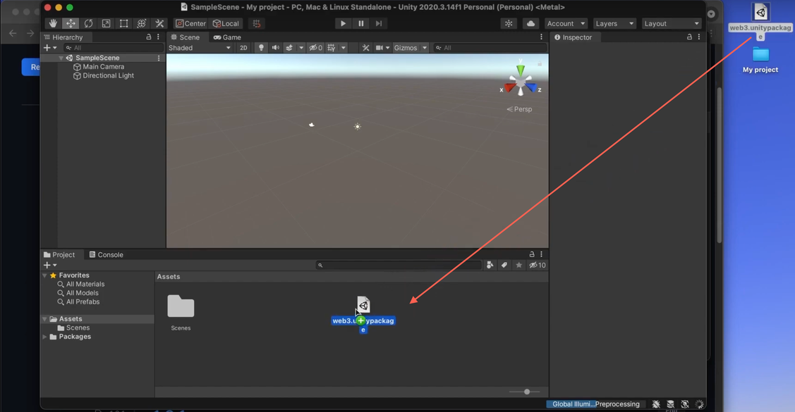

# Create a New Unity Project 

The SDK / Unity plugin supports all Unity project types. In this example, you will see how to create an empty 3D project.

To create a new project, open **Unity Hub** and select **All templates**. 
We will use a 3D template, then click on **Create project**.

Now, you have created a new project, we need to import the SDK into our project.

Drag the downloaded web3.unitypackage file in the [Installation]() section into the Unity project.

Depending on the version of Unity you are using, you might see the error in the screen below. If it’s the case, please refer to the [Solving the Newtonsoft Error]() section to solve it.

